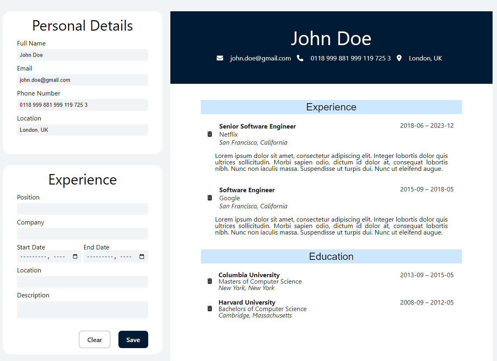

<!-- TABLE OF CONTENTS -->

  
Table of Contents

  <ol>
    <li>
      <a href="#about-the-project">About The Project</a>
      <ul>
        <li><a href="#built-with">Built With</a></li>
      </ul>
    </li>
    <li><a href="#contact">Contact</a></li>
  </ol>

<!-- ABOUT THE PROJECT -->

## About The Project

This project came from The Odin Project (TOP) and it helped me in learning react.

https://www.theodinproject.com/lessons/node-path-react-new-cv-application

It helped me with learning React components and how to structure my code.

The left side of the app is where the user can input their personal details, experience, and education. The info will be outputted to a resume-like format on the right side.

<!-- BUILT WITH -->

### Built With

- 
- 
- 

(<a href="#readme-top">back to top</a>)

<!-- CONTACT -->

## Contact

Julian So: 

Project Link: [https://github.com/julianchso/odin-CV-application](https://github.com/julianchso/odin-CV-application)

(<a href="#readme-top">back to top</a>)

